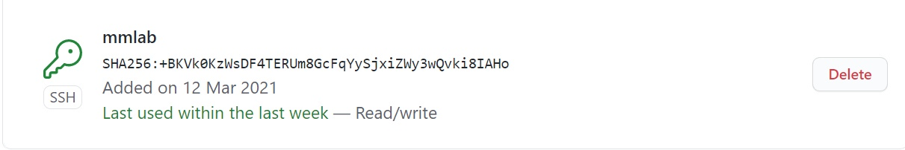
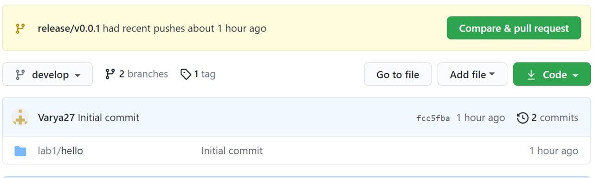

---
## Front matter
title: "Лабораторная работа №1: Работа с Git. Создание отчетов в Markdown"
subtitle: "*дисциплина: Математическое моделирование*"
author: "Голова Варвара Алексеевна"
date: 2021, 03 April

## Formatting
mainfont: PT Serif
romanfont: PT Serif
sansfont: PT Sans
monofont: PT Mono
toc: false
slide_level: 2
theme: metropolis
header-includes:
 - \metroset{progressbar=frametitle,sectionpage=progressbar,numbering=fraction}
 - '\makeatletter'
 - '\beamer@ignorenonframefalse'
 - '\makeatother'
aspectratio: 43
section-titles: true

---

# Цель работы

Ознакомиться с возможностями системы контроля Git и работой в Markdown.

# Задание

Создать локальный git-репозиторий, а также создать и опубликовать релиз.

# Выполнение лабораторной работы

## SSH-ключ

Ключ был добавлен на github ранее с помощью команды ssh-keygen -t rsa(рис. -@fig:001).

{ #fig:001 width=70% }

## Работа с git flow, создание релиза

Я инициализировала репозиторий с помощью git flow, создала файл hello.html с текстом "Hello, World!". Затем выгрузила на ветку develop. Далее создала новую feature с помощью git flow feature start и выгрузила итоговые изменения на github с помощью git push. В итоге создала релиз с версией v0.0.1

## Результат

Репозиторий после релиза (рис. -@fig:002).

{ #fig:002 width=70% }

# Выводы

Я ознакомилась с возможностями системы контроля Git и работой в Markdown.
