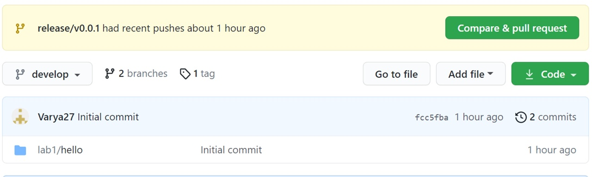

---
# Front matter
title: "Отчет по лабораторной работе №1"
subtitle: "Работа с Git. Создание отчетов в Markdown"
author: "Голова Варвара Алексеевна"
group: "НФИбд-03-18"
ID: "1032182507"

# Formatting
toc-title: "Содержание"
toc: true # Table of contents
toc_depth: 2
lof: true # List of figures
fontsize: 12pt
linestretch: 1.5
papersize: a4paper
documentclass: scrreprt
polyglossia-lang: russian
polyglossia-otherlangs: english
mainfont: PT Serif
romanfont: PT Serif
sansfont: PT Sans
monofont: PT Mono
mainfontoptions: Ligatures=TeX
romanfontoptions: Ligatures=TeX
sansfontoptions: Ligatures=TeX,Scale=MatchLowercase
monofontoptions: Scale=MatchLowercase
indent: true
pdf-engine: lualatex
header-includes:
  - \linepenalty=10 # the penalty added to the badness of each line within a paragraph (no associated penalty node) Increasing the value makes tex try to have fewer lines in the paragraph.
  - \interlinepenalty=0 # value of the penalty (node) added after each line of a paragraph.
  - \hyphenpenalty=50 # the penalty for line breaking at an automatically inserted hyphen
  - \exhyphenpenalty=50 # the penalty for line breaking at an explicit hyphen
  - \binoppenalty=700 # the penalty for breaking a line at a binary operator
  - \relpenalty=500 # the penalty for breaking a line at a relation
  - \clubpenalty=150 # extra penalty for breaking after first line of a paragraph
  - \widowpenalty=150 # extra penalty for breaking before last line of a paragraph
  - \displaywidowpenalty=50 # extra penalty for breaking before last line before a display math
  - \brokenpenalty=100 # extra penalty for page breaking after a hyphenated line
  - \predisplaypenalty=10000 # penalty for breaking before a display
  - \postdisplaypenalty=0 # penalty for breaking after a display
  - \floatingpenalty = 20000 # penalty for splitting an insertion (can only be split footnote in standard LaTeX)
  - \raggedbottom # or \flushbottom
  - \usepackage{float} # keep figures where there are in the text
  - \floatplacement{figure}{H} # keep figures where there are in the text
---

# Цель работы

Ознакомиться с возможностями системы контроля Git и работой в Markdown.

# Задание

Создать локальный git-репозиторий, а также создать и опубликовать релиз.

# Выполнение лабораторной работы

## SSH-ключ

Ключ был добавлен на github ранее с помощью команды ssh-keygen -t rsa(рис. -@fig:001).

{ #fig:001 width=70% }

## Работа с git flow, создание релиза

Я инициализировала репозиторий с помощью git flow, создала файл hello.html с текстом "Hello, World!". Затем выгрузила на ветку develop. Далее создала новую feature с помощью git flow feature start и выгрузила итоговые изменения на github с помощью git push. В итоге создала релиз с версией v0.0.1

## Результат

Репозиторий после релиза (рис. -@fig:002).

{ #fig:002 width=70% }

# Выводы

Я ознакомилась с возможностями системы контроля Git и работой в Markdown.
